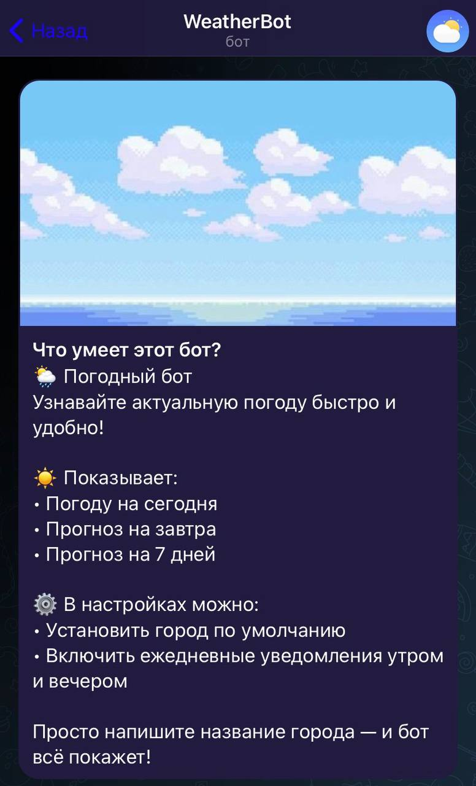
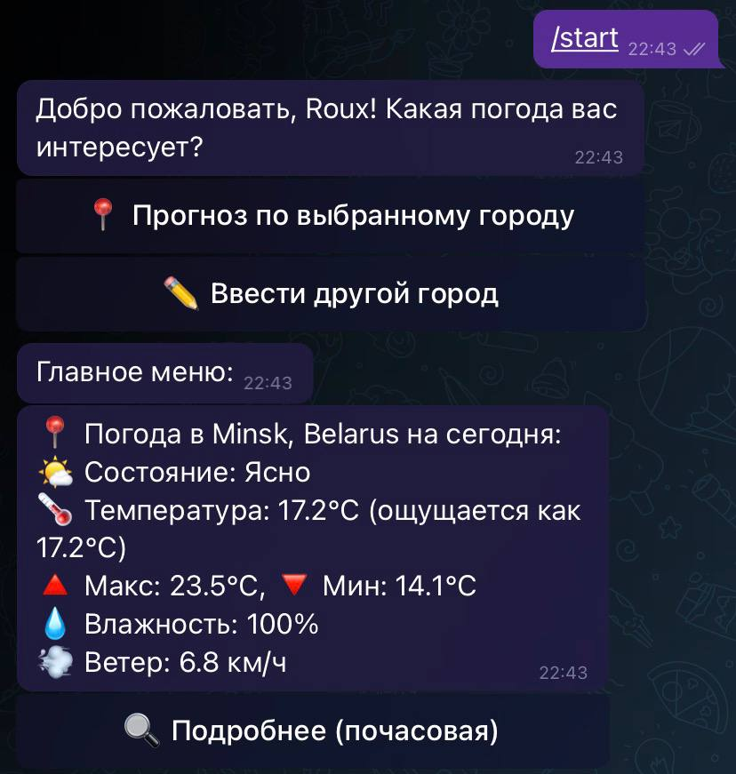
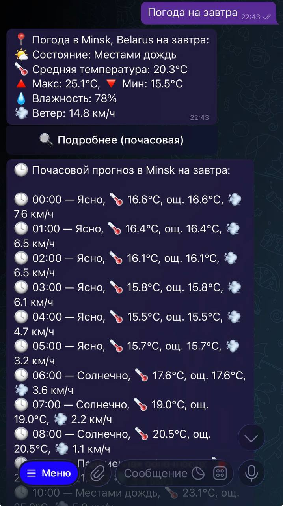
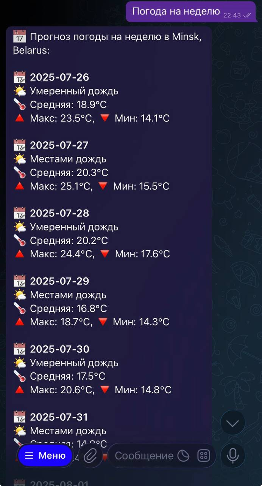
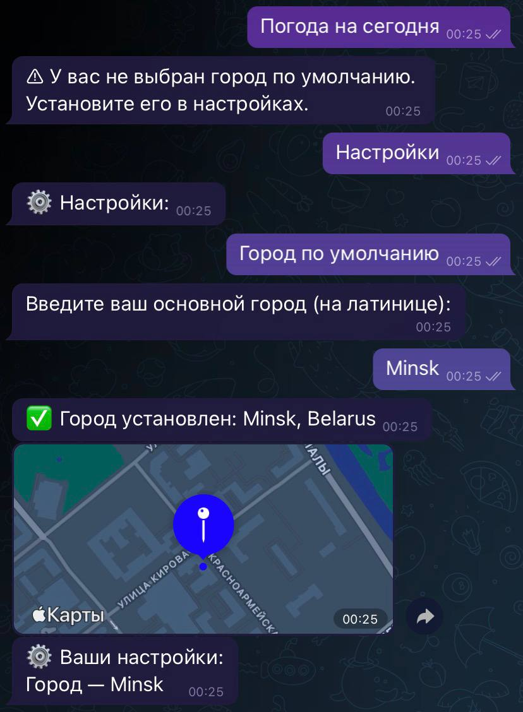

# 🌤️ WeatherBot — Телеграм-бот погоды

 
 

**WeatherBot** — это Telegram-бот на Python с использованием `aiogram`, который показывает текущую погоду, прогноз на день, завтра и неделю, а также поддерживает уведомления о погоде в установленное время.

---

## 🚀 Возможности

- 🌍 Показывает **текущую погоду** по городу, выбранному в настройках
- 🏙️ Получение погоды **по другому городу разово**
- 📅 Прогноз **на сегодня** и **на завтра**
- ⏰ Поддержка **почасовой погоды** (через inline-кнопку)
- 📆 Прогноз **на неделю**
- ⚙️ Уведомления:
  - Утренние и вечерние уведомления о погоде (настраиваются в настройках)
- 📲 Команда `/start` для запуска и настройки

---

## 🛠️ Технологии

- Python `3.10.11`
- [`aiogram==2.25.2`]
- `aiohttp`, `python-dotenv` и другие

Полный список зависимостей — в файле `requirements.txt`

## Запуск
1. Клонировать репозиторий
2. Установить зависимости: pip install -r requirements.txt
3. Вставить токен в main.py
4. Запустить: python main.py

> ⚠️ Внимание: проект учебный, все функции находятся в одном файле.

Приветственное сообщение при открытии бота. Здесь кратко описано, что умеет бот, как пользоваться и какие настройки доступны.  

Стартовое сообщение после запуска бота. Пользователь видит приветствие с именем и выбор города. Внизу две кнопки: "Прогноз по выбранному городу" и "Ввести другой город".  

Отображение почасовой погоды на сегодня после нажатия кнопки "Подробнее".  

Прогноз погоды на неделю для выбранного города.  

Если город по умолчанию не выбран, бот предлагает установить его через настройки. После установки отображается карта с геолокацией и погодой на сегодня.  

Настройки утренних и вечерних уведомлений. Пользователь может включить уведомления по своему расписанию.  

Пример отключения утренних и вечерних уведомлений через настройки бота.  
